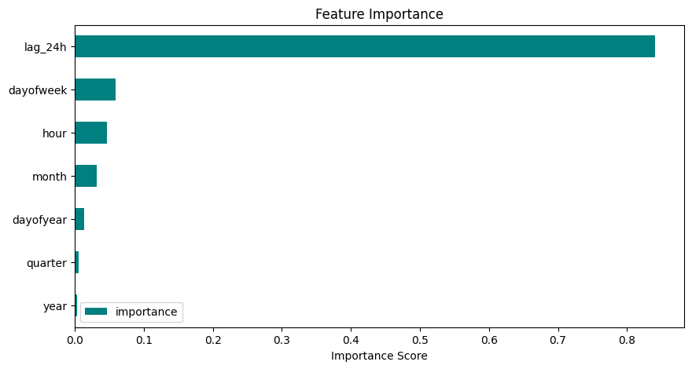

# PJM Hourly Energy Consumption Forecasting ⚡

## 📌 Project Overview
PJM Interconnection is a major regional transmission organization in the US. This project builds a high-precision forecasting model to predict hourly electricity load (MW). Accurate load forecasting is the backbone of grid stability and economic dispatch.

This project demonstrates a complete Data Science workflow: from **handling time-series integrity** and **feature engineering** to **advanced model diagnostics**.

## 🚀 Key Achievements
- **35% Accuracy Boost**: By engineering **24-hour Lag Features**, the model's RMSE dropped from **3,727 MW** to **2,437 MW**.
- **Data Integrity**: Cleaned 140,000+ hourly records, resolving duplicate timestamps and ensuring continuous time-series flow.
- **Root Cause Analysis**: Identified specific model failures during "Post-Holiday Recovery" (e.g., July 4th) and "Shoulder Month" weather volatility.
- **Unbiased Model**: Verified through residual analysis that the model is globally unbiased with a zero-centered error distribution.

## 📊 Technical Deep Dive

### 1. Feature Engineering
Beyond basic calendar features (hour, day, month), I introduced a **Lag-24h** feature. This allows the XGBoost model to anchor its predictions on the previous day's consumption pattern, significantly capturing short-term trends.

### 2. Residual Diagnostics
The residual boxplot reveals that while the model is accurate on average, variance increases during peak hours. This insight suggests that the current "Calendar-aware" model would benefit from becoming "Climate-aware" by integrating weather data (Temperature/Humidity).

### 3. Outlier Investigation
- **Holiday Effect**: The model under-estimated demand on July 5th because it relied on the lower consumption from the July 4th holiday.
- **Weather Volatility**: Sudden temperature shifts in May led to over-predictions, highlighting the impact of exogenous variables.

## 🛠️ Tech Stack
- **Modeling**: XGBoost Regressor
- **Data**: Pandas, NumPy
- **Viz**: Matplotlib, Seaborn
- **Environment**: Jupyter Notebook (Python 3.12)

## 📂 Repository Structure
- `Time_Series_Energy_Analysis.ipynb`: Full analytical pipeline.
- `PJME_hourly.csv`: Raw hourly load data (not included in repo, link provided below).

## 📈 Future Roadmap
- [ ] Integrate NOAA Weather Data (Temperature/Heat Index).
- [ ] Implement Holiday-specific binary flags.
- [ ] Experiment with Prophet or LSTM for comparison.
